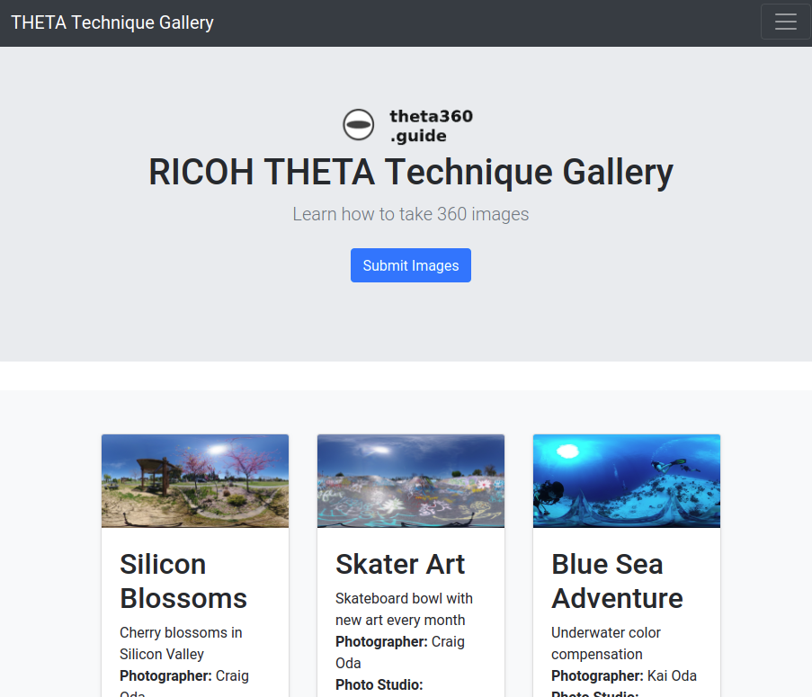
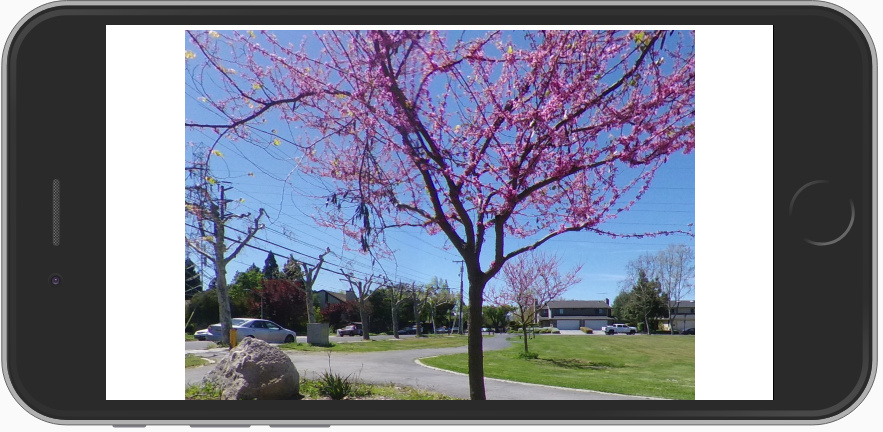

# RICOH THETA Technique Gallery

Test bed for 360 image web site technologies.

## Technologies Used

* A-Frame
* Bootstrap 4
* Django 2.2
* Python 3.6
* PostgreSQL
* RICOH THETA V and Z1

## Install Locally

Setup a local Python virtualenv and activate it.

    pip install -r requirements.txt

## Run it

    python manage.py runserver

Example

    (myvenv) craig@cube:~/Development/ricoh/gallery$ python manage.py runserver
    Watching for file changes with StatReloader
    Performing system checks...

    System check identified no issues (0 silenced).
    June 28, 2019 - 21:24:43
    Django version 2.2.1, using settings 'portfolio.settings'
    Starting development server at http://127.0.0.1:8000/
    Quit the server with CONTROL-C.

## Screenshots

