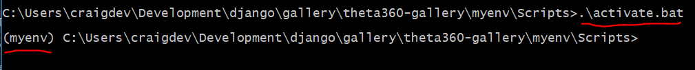
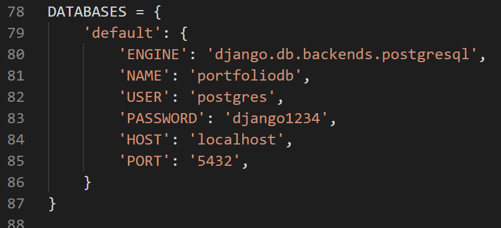
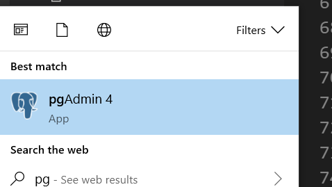
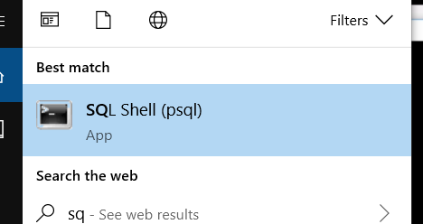
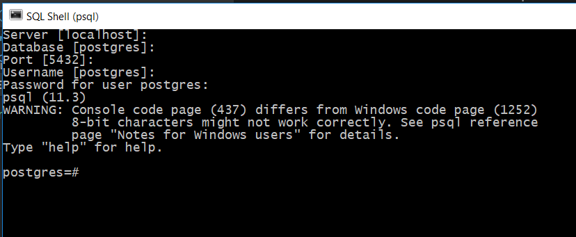
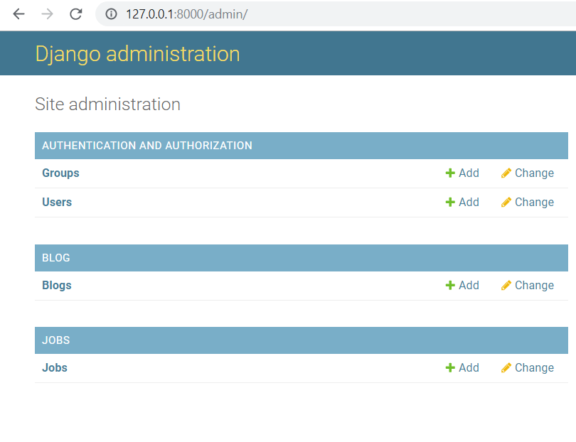

# RICOH THETA Technique Gallery

Test bed for 360 image web site technologies.

[Live Site](https://gallery.theta360.guide)
-------------------------------------------

## Technologies Used

* A-Frame
* Bootstrap 4
* Django 2.2
* Python 3.6
* PostgreSQL
* RICOH THETA V and Z1

## Install Locally

Setup a local Python virtualenv and activate it.

### virtualenv

    C:\>virtualenv myenv
    Using base prefix 'c:\\users\\craigdev\\appdata\\local\\programs\\python\\python37-32'
    New python executable in C:\Users\craigdev\Development\django\gallery\theta360-gallery\myenv\Scripts\python.exe
    Installing setuptools, pip, wheel...
    done.

Activate virtualenv

Run the activate script.  This varies depending on whether you are using Linux, Mac, or Windows. Example for activating virtualenv on Windows is shown below.

### Python requirements

The requirements.txt

    pip install -r requirements.txt

### migrate

In the virtualenv, run `python manage.py migrate`

    (myenv) C:\Users\craigdev\Development\django\gallery\theta360-gallery>python manage.py migrate
    Operations to perform:
    Apply all migrations: admin, auth, blog, contenttypes, jobs, sessions
    Running migrations:
    Applying blog.0003_auto_20190517_1516... OK
    Applying blog.0004_auto_20190517_1522... OK
    Applying blog.0005_blog_production... OK
    Applying blog.0006_blog_testing_tag... OK
    Applying jobs.0002_job_moreinfo... OK
    Applying jobs.0003_auto_20190515_1843... OK
    Applying jobs.0004_auto_20190515_2230... OK
    Applying jobs.0005_job_level... OK
    Applying jobs.0006_job_idea_by... OK
    Applying jobs.0007_auto_20190628_2043... OK
    Applying jobs.0008_auto_20190628_2046... OK
    Applying jobs.0009_job_photo_studio... OK

## Run Django Server 

    python manage.py runserver

Example

    (myvenv) craig@cube:~/Development/ricoh/gallery$ python manage.py runserver
    Watching for file changes with StatReloader
    Performing system checks...

    System check identified no issues (0 silenced).
    June 28, 2019 - 21:24:43
    Django version 2.2.1, using settings 'portfolio.settings'
    Starting development server at http://127.0.0.1:8000/
    Quit the server with CONTROL-C.

test on 127.0.0.1:8000

## Database Setup

In `portfolio/settings.py`, you can see the Postgresql settings.

After installing Postgresql, you can see the database with pgadmin. 

Use the command line tool sql shell to set up the db.

For development, the password is set to `django1234`.

## django admin

Create the django superuser with `python manage.py createsuperuser`

    >python manage.py createsuperuser
    Username (leave blank to use 'craigdev'): django
    Email address:
    Password:
    Password (again):
    The password is too similar to the username.
    Bypass password validation and create user anyway? [y/N]: y
    Superuser created successfully.

### Start Django

    $ python manage.py runserver

### Upload Content

Go to `http://localhost:8000/admin` and create a job.

## Screenshots

